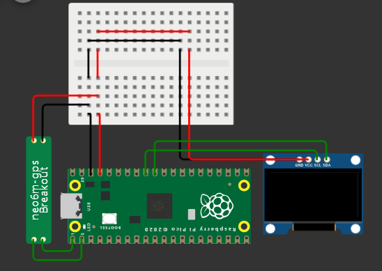
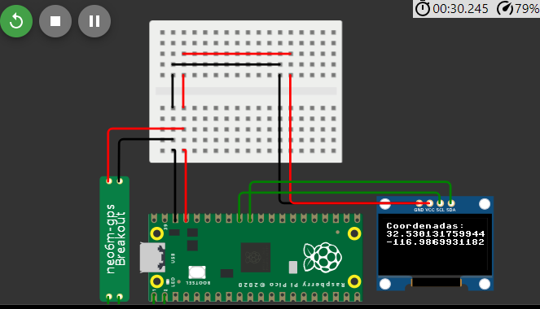

# 3.1.1 En EQUIPO: GPS + Oled Temático + Wokwi.com
Enlace a la mi cuenta de wokwi [ir al emulado](https://wokwi.com/projects/381622986245649409)

## Captura de pantalla antes de la corrida


## Captura de pantalla de la corrida


## C&#243;digo
```python
from machine import Pin, I2C, UART
from ssd1306 import SSD1306_I2C
import sys
import time
import gps

pix_res_x = 126
pix_res_y = 64

# Definición de funciones

def init_i2c(scl_pin, sda_pin):
    # Initialize I2C device
    i2c_dev = I2C(1, scl=Pin(scl_pin), sda=Pin(sda_pin), freq=200000)
    i2c_addr = [hex(ii) for ii in i2c_dev.scan()]
    
    if not i2c_addr:
        print('No I2C Display Found')
        sys.exit()
    
    return i2c_dev

def display_text(oled):
    # Display text on the OLED
    oled.text("Raspberry Pi", 0, 0)
    oled.show()

def main():
    # Establece conexión con el display
    i2c_dev = init_i2c(scl_pin=27, sda_pin=26)
    oled = SSD1306_I2C(pix_res_x, pix_res_y, i2c_dev)
    #display_text(oled)

    # Conexión con el GPS
    #uart = UART(1, baudrate=9600, tx=Pin(0), rx=Pin(1))
    gps.position(oled)


# Código principal
if __name__ == '__main__':
    main()

```