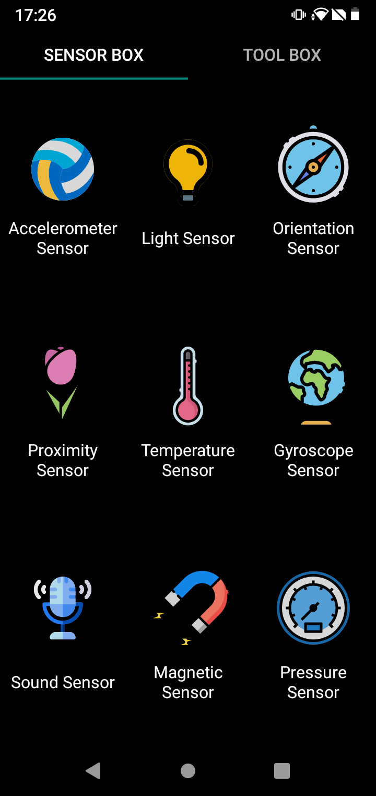
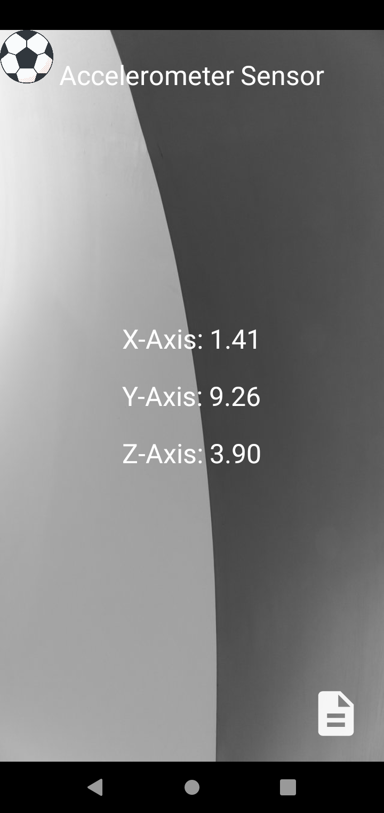
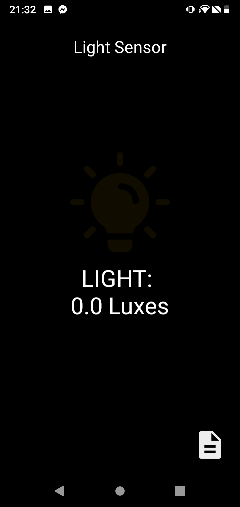
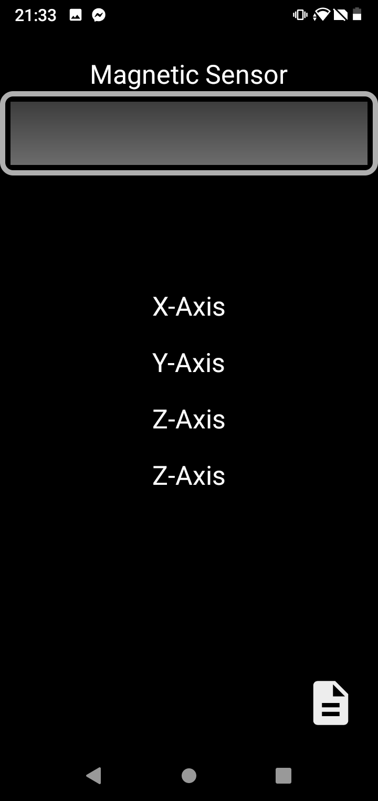

# Sensor que tiene mi Smarphote

## Los que tiene son
- Sensor Acceleracion

- Sensor de Aproximidad

- Sensor de luz

- Sensor de Magnetismo

- Sensor de Sonido

En este caso son todos los sensores que tiene mi smarphone como se muestra en las imagenes son todos los sensores y es malo que no me muestre los que no puede monstrar los que no estan disponidles los sensores en el telefono.